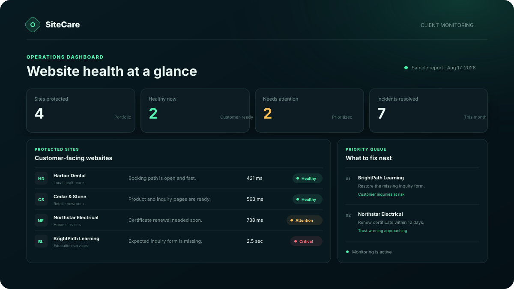
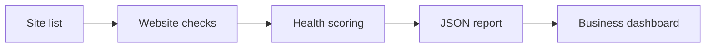

# SiteCare: Website Care Monitor

[](https://github.com/ramphalharrilal/website-care-monitor/actions/workflows/ci.yml)
[](https://ramphalharrilal.github.io/website-care-monitor/)
[](https://nodejs.org/)
[](LICENSE)



SiteCare is a client-friendly website health monitor. It turns availability, speed, certificate, and contact-form checks into a clear answer to one business question:

> Is the website ready for customers, and what should be fixed next?

[Open the interactive demo](https://ramphalharrilal.github.io/website-care-monitor/) · [Read the case study](docs/case-study.md) · [Review the architecture](docs/architecture.md)

## The business problem

Small businesses often discover website failures after a customer complains—or after leads have already been lost. Traditional monitoring tools can make the problem harder by reporting technical signals without explaining their business impact.

| Risk | SiteCare check | Plain-English outcome |
| --- | --- | --- |
| Customers cannot reach the site | Availability and HTTP status | “Customers cannot reach the website.” |
| A page is slow enough to lose attention | Response time | “The page is working, but it needs attention.” |
| Browsers may soon show a security warning | TLS certificate expiry | “Renew the security certificate within 12 days.” |
| Visitors cannot find a way to inquire | Expected form presence | “Restore the missing inquiry form.” |

## What is working today

- A zero-dependency Node.js monitor that checks real URLs.
- Availability, HTTP status, response time, TLS-expiry, and expected form-presence checks.
- A scoring engine that sorts results into **healthy**, **attention**, and **critical** states.
- A JSON report for other tools to consume.
- A responsive static dashboard for GitHub Pages.
- Automated tests, repository validation, a health endpoint, security headers, and a container build.

The public dashboard uses fictional businesses and sample results. It is a safe portfolio demonstration, not a claim that those organizations are real customers. An automated test verifies that every displayed sample score and status follows the same scoring engine as a live check. The command-line monitor performs the live checks.

## Run it locally

Requires Node.js 22 or newer.

```bash
npm install
npm test
npm run validate
npm start
```

Open `http://localhost:3000` after starting the server.

To run the monitor against the example configuration:

```bash
npm run check
```

The report is written to `reports/latest-report.json`.

## Configure monitored sites

Copy `config/sites.example.json`, then describe each business site:

```json
{
  "sites": [
    {
      "name": "Main business website",
      "url": "https://example.com",
      "expectContactForm": false
    }
  ],
  "settings": {
    "timeoutMs": 8000,
    "slowResponseMs": 2000,
    "certificateWarningDays": 21
  }
}
```

`expectContactForm` checks for the presence of an HTML `<form>` element. It does not submit the form or store customer information.

## How it works



The implementation deliberately separates checks, scoring, reporting, and presentation. That keeps business rules testable and makes it possible to replace the static demo data with scheduled reports later.

## Quality and safety

- Tests cover status classification, timeout/error handling, form detection, TLS integration, and the demo health endpoint.
- The local server blocks path traversal and returns defensive browser headers.
- The monitor uses read-only `GET` requests, follows redirects, and applies a configurable timeout.
- No credentials, form submissions, analytics, or personal customer data are collected.
- GitHub Actions runs the test and validation suite on every push and pull request.

See [SECURITY.md](SECURITY.md) for responsible use and reporting.

## Roadmap

- Scheduled monitoring with report history.
- A same-domain broken-link crawler.
- Form journey testing in an isolated test environment.
- Email and webhook summaries with deduplication.
- Persisted service-level reporting for monthly client reviews.

## Project context

This repository demonstrates how I approach support and quality work: start with the customer impact, automate repeatable checks, document the operating boundary, and make the next action obvious.

Built by [Ramphal Harrilal](https://ramphalharrilal.github.io/). Licensed under the [MIT License](LICENSE).
