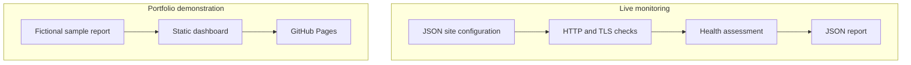

# Architecture

SiteCare is divided into a monitoring path and a presentation path.

## Components

| Component | Responsibility | Boundary |
| --- | --- | --- |
| `src/check-site.js` | Fetch a configured page and inspect its transport and HTML response | Read-only request; no form submission |
| `src/health.js` | Apply thresholds, produce a score, status, summary, and issues | Pure business logic; no network access |
| `src/cli.js` | Load configuration, run checks, and write a report | Sequential by design in the first release |
| `src/server.js` | Serve the public demo and a health endpoint | Local demo server, not an internet-facing API |
| `public/` | Render a client-facing dashboard from sample JSON | Fictional portfolio data only |

## Health model

An unreachable site is immediately critical with a score of zero. Reachable sites begin at 100 and receive deductions for customer-affecting conditions.

| Condition | Score impact |
| --- | ---: |
| HTTP server error | -70 |
| HTTP client/error page | -45 |
| Slow response | -18 |
| Expired certificate | -60 |
| Certificate near expiry | -22 |
| Missing expected form | -20 |
| Broken-link findings supplied to the scorer | up to -25 |

Scores of 85–100 are healthy, 55–84 need attention, and 0–54 are critical.

The scoring engine can already evaluate broken-link findings supplied by another check. Automated link discovery is intentionally listed as roadmap work rather than represented as a finished feature.

## Failure behavior

- Each HTTP request has a timeout and records an unreachable result instead of crashing the report.
- TLS errors are retained as diagnostic information while HTTP assessment continues.
- The static dashboard shows a visible error state when the sample report cannot be loaded.
- The demo server returns 404 for unknown files and rejects non-GET methods.

## Deployment

Continuous integration runs tests and repository validation on pushes and pull requests. A separate least-privilege workflow uploads only `public/` as a GitHub Pages artifact.
